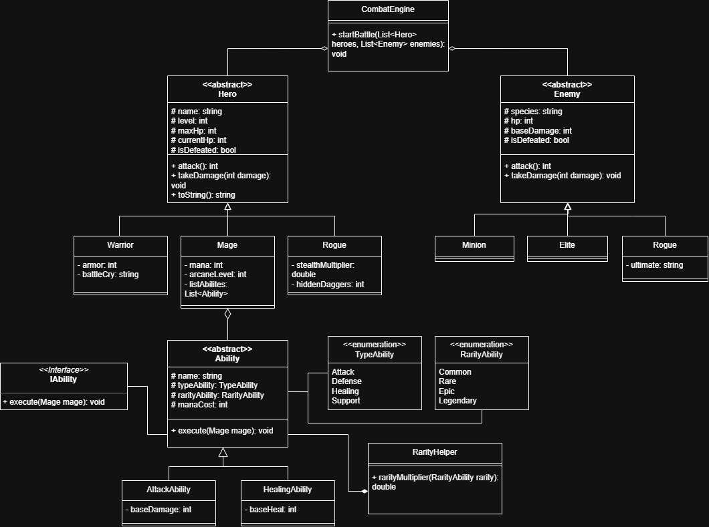
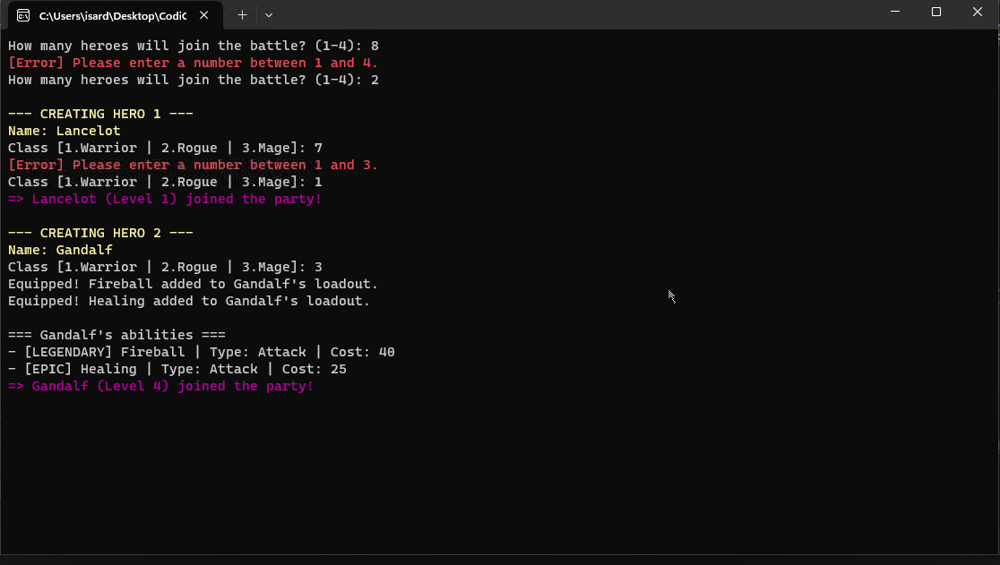
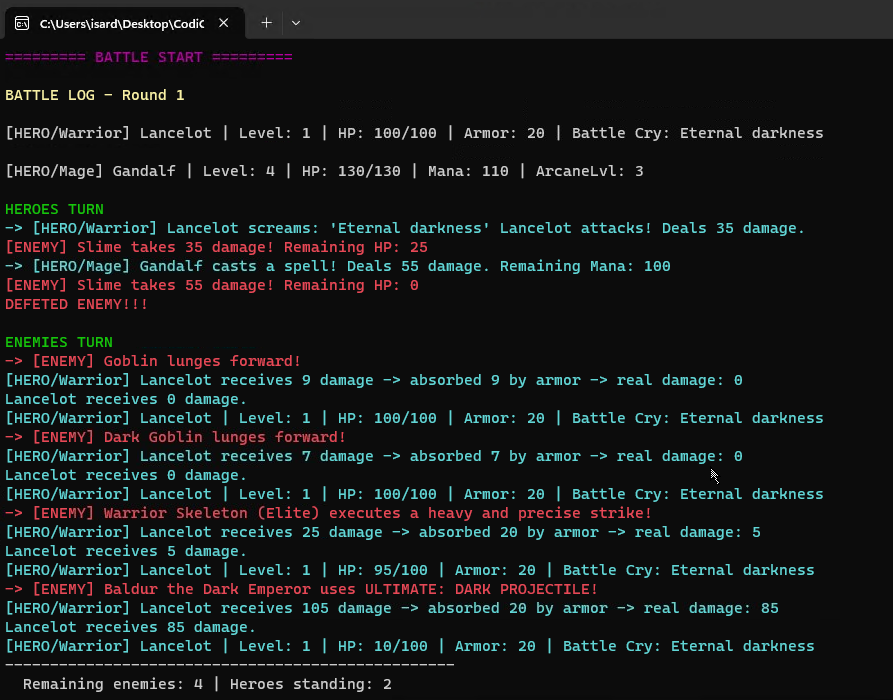

# ⚔️ HeroEngine: OOP Quest

**HeroEngine** és un projecte (tipus videojoc) de combat per torns desenvolupat en C#. Aquest projecte s'ha fet per treballar sobre principis fonamentals de la **Programació Orientada a Objectes (OOP)**: Herència, Polimorfisme, Encapsulació i l'ús d'Interfícies i Enums.

A més, el projecte inclou certa interactivitat a l'hora de crear els grup de **heroes** on podràs escollir els noms dels integrants d'aquets com de quin tipus vols que siguin: Mage, Warrior, Rogue.

---

## 📖 Arquitectura i Capítols del Projecte

El desenvolupament s'ha dividit en 4 capítols estructurats mitjançant branques de Git. A continuació, es parlarà més a detall sobre cadascú.

### 🛡️ Chapter 1: The Heroes Council (Hero Hierarchy)
S'ha dissenyat una jerarquia de classes robusta amb una classe abstracta base `Hero` i tres classes derivades: `Warrior`, `Mage`, i `Rogue`. S'ha utilitzat l'encadenament de constructors (`base`) i l'escalat automàtic d'estadístiques basat en el nivell.

**🛠️ Gestió d'Errors i Validacions:**
* **Nivells invàlids:** Si s'intenta instanciar un heroi amb un nivell igual o inferior a 0, el constructor assigna automàticament el nivell 1.
* **Prevenció de HP negatiu:** El mètode `ReceiveDamage(int damage)` assegura que la vida (`CurrentHP`) mai baixi de 0.

---

### ✨ Chapter 2: The Armoury (Ability System)
S'ha creat un sistema d'habilitats utilitzant la interfície `IAbility` asignada a la classe abstracta 'AAbility'. S'han integrat `Enums` per classificar els tipus i raresa de les habilitats, acompanyats d'un `RarityHelper` per aplicar els multiplicadors.

**🛠️ Gestió d'Errors i Validacions:**
* **Gestió de Mannà (Mage):** Si un Mag intenta utilitzar una habilitat però no té prou mannà aquest executa un atac físic bàsic per atacar, amb bastant menys dany.

---

### 🤜 Chapter 3: The Battlefield(Combat Engine)
Implementació del motor del joc (`CombatEngine`) amb un bucle interactiu, entrada de dades de l'usuari i generació d'enemics (`Minion`, `Elite`, `Boss`).

El combat va per rondes on en cada una tots els teus **heroes** ataquen als enemics i desprès són els enemics qui ataquen als teus personatges. Al final de cada ronda es mostrarà els enemics i herois que queden en la batalla.

**🛠️ Gestió d'Errors i Validacions:**
* **Protecció d'Inputs (Console):** Totes les interaccions de l'usuari per escollir el nombre de **heroes** en la teva party/group, com també l'elecció de classe de `Hero` estan sota una verificació de que la opció escollida està entre les opcions vàlides.
  > *"[Error] Please enter a number between 1 and 4."*

---
## Casos de prova (Test cases)
| ID | Cas de Prova | Entrades | Acció | Sortida Esperada |
| :--- | :--- | :--- | :--- | :--- |
| **TC-01** | **Límits de creació de la *party*** | `5`, `0` o `text` | L'usuari introdueix un valor fora del rang o un caràcter no numèric quan el joc demana la quantitat d'herois a crear (1-4). | El sistema no fa *crash*. Mostra el missatge: `[Error] Please enter a number between 1 and 4.` i torna a demanar l'entrada fins que sigui correcta. |
| **TC-02** | **Selecció de classe invàlida** | `4`, `-1` o `text` | Durant la creació de l'heroi, a la tria de classe (1.Warrior, 2.Rogue, 3.Mage), l'usuari posa una opció no contemplada. | El mètode de validació ho intercepta, mostra l'error `[Error] Please enter a number between 1 and 3.` i torna a demanar l'entrada. |
| **TC-03** | **Límit inferior d'HP (Zero)** | Heroi amb `15 HP` Dany rebut: `40` | Durant el torn enemic, l'heroi rep un atac el dany del qual supera la seva vida actual, forçant un resultat negatiu. | La funció `TakeDamage` absorbeix el dany, però lliga l'HP a un mínim de 0. La consola mostra: `... takes 40 damage! Remaining HP: 0` (no -25). L'heroi es marca automàticament com a `IsDefeated = true`. |

---
## Diagrama de classes UML
  

--- 

## Imatges creació de personatges i sistema de combat

  

  

